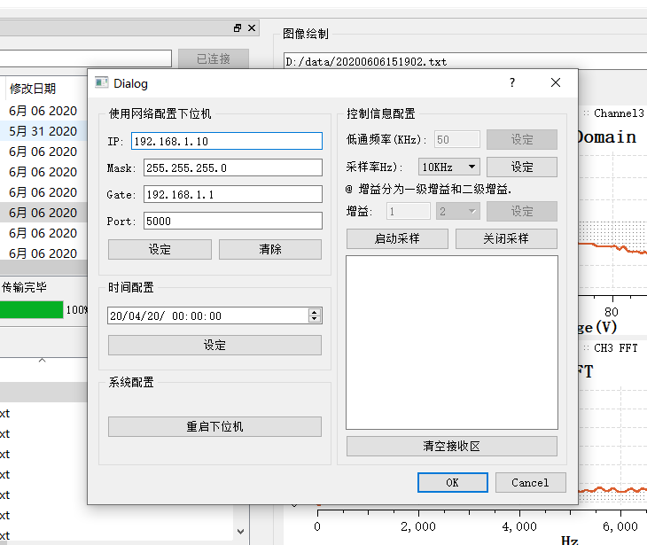
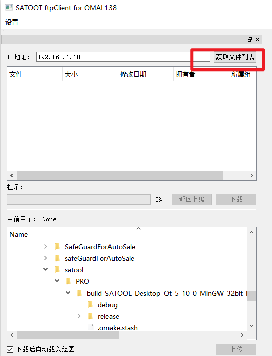

# SATOOL使用说明

SATOOL是一款基于TCP和FTP协议的数据传输和分析工具性软件，通过TCP网络协议与基于OMAPL138为核心的数据采集记录板（以下简称：OMAP内记仪）进行配置；通过FTP数据传输协议与OMAP内记仪进行采样数据交换，实现与OMAP内记仪的配置和下载的双向数据流通。

## 0 代码下载

下载代码：`git clone https://github.com/carloscn/satool.git`

加载子模块： `git submodule init`

下载依赖库：`git submodule update`

国内镜像地址： https://gitee.com/carloswei/satool

## 1 硬件使用要求

在硬件上面关键是对于网络和电源的配置。请关注以下网络配置功能，**同时对于电源请使用+12V/2A的直流电源进行稳定持续性供电**。

### 1.1 网络拓扑结构

#### 1.1.1 路由器接法

使用路由器可连接多个PC终端，开启DHCP自动获取IP即可。**OMAP内记仪的IP默认为192.168.1.10**。路由器接法主要好处在于多PC终端的支持。

#### 1.1.2 网口直连法

网口直连法即通过网线直接将OMAP内记仪与PC机连接在一起。网络拓扑结构简单，传输速度快，需要在PC机上对网卡进行配置。进入网卡的TCP/IPv4配置界面，配置IP为如图所示。IP地址只要是192.168.1.XXX下即可，XXX数字任意但不要超过255，也不要和OMAPL内记的IP（默认192.168.1.10）冲突。DNS设定与否不影响本软件的网络传输。

#### 1.1.3 测试网络连通

以OMAPL内记仪的IP为默认为例，物理连接建立好后进行网络连通测试。在cmd终端使用ping命令进行检测。输入`ping 192.168.1.10`，如果为下图所示输出，则网络建立成功。

### 1.2 硬件实物接线

* 请确保网口插紧
* 请确保电源12V直流供电，推荐12V/2A的适配器。

## 2 软件界面

### 2.1 主界面

如图所示为软件的主界面，SATOOL的软件界面分为两大区域，左侧为FTP文件管理区，右侧围图像分析区域。FTP管理区域可实现对OMAP内记仪的FTP文件访问（下载、上传、删除、新建文件夹）操作；图像分析区域可实现对OMAP内记仪数据的时域和频域图像绘制。

### 2.2 配置界面

点击左上角菜单栏设置->进入配置，弹出以下配置界面。注意：由于该界面需要从板子获取配置信息，所以如果和板子网络不连通的状态该界面无法弹出。

该界面包含了对OMAP内记仪的网络配置、时间配置、重启、采样率配置以及（增益、低通滤波器）预留功能的配置。

## 3 软件下载与安装

### 3.1 软件下载

本软件托管到github的版本控制系统中，可随时随地在github上获取最新的软件源程序和软件可执行程序，下载地址为： https://github.com/carloscn/satool/releases

软件会在时间线上平铺新旧版本的记录，可随时回溯旧版本。

### 3.2 软件安装

点击下载图中红方框中的文件。下载后使用压缩软件解压7z文件。建议将文件解压到临时目录后再剪切到 C:\Program File(x86)\ 下。

找到SATOOL.exe，右键发送到桌面快捷方式。

### 3.2 运行软件

双击桌面的快捷方式后运行软件。

## 4 软件使用

### 4.1 配置功能使用

输入相关信息后点击下面的设定即可。需要注意的是，每个设定仅在其所在作用域范围内生效，非全局生效。如果配置成功后软件会提示已写入配置。如图所示。

如果配置失败（如图所示）。出现此情况，建议重启软件和板子操作。

### 4.2 FTP功能使用

#### 4.2.1 FTP访问路径

点击获取文件列表，SATOOL通过FTP协议访问OMAP内记仪的内部文件。

获取后为OMAP内记仪的根目录，代表已经建立了FTP稳定传输服务。

进入mnt

进入mmcblk0p1

就可以看到板子的数据文件。

#### 4.2.2 下载数据

选择本地存储路径，本文选择data文件夹。用户可自行选择，但一定要选择。

对FTP数据列表右键->下载即可传输完毕数据。

也可以按住CTRL键多选数据，然后批量下载。

使用CTRL-A快捷键，全选数据，然后批量下载。

若勾选下载后自动绘图功能，下载的数据文件将自动载入右侧绘图缓冲中。

### 4.3 绘图功能使用

绘图功能有文件载入、量程范围选择、分块与滑动显示功能。

#### 4.3.1 文件载入

点击载入，弹出文件对话框，选择要绘制的数据文件。如果在FTP下载中勾选自动下载功能了，下载的文件将自动刷新到绘图缓冲中。点击绘制图像就会显示缓冲的数据。

#### 4.3.2 量程范围选择

量程范围分为5V/10V，图像时域绘制根据量程范围放缩坐标scale。

#### 4.3.3 分块绘制

数据图像文件很长，绘图视窗无法完全显示出来，因此将数据分块显示。通过块大小来决定时域一次性显示的长度，推荐128长度。（图像过于密集就会出现错误的显示，比如曲线弯曲的情况）。数据就会按照块长度进行分块，块数在右下角，通过拨动快spinBox调整块的位置（或者滑动进度条控制块）来控制快数据显示。

## 5 软件退出

请先关闭软件后，关闭OMAP电源。
